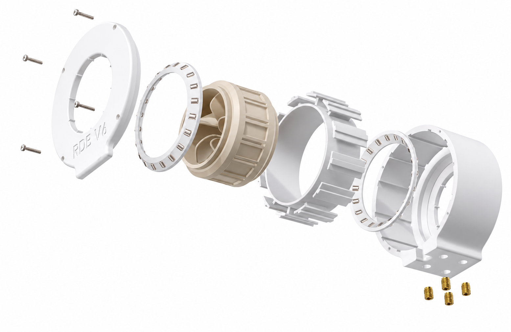
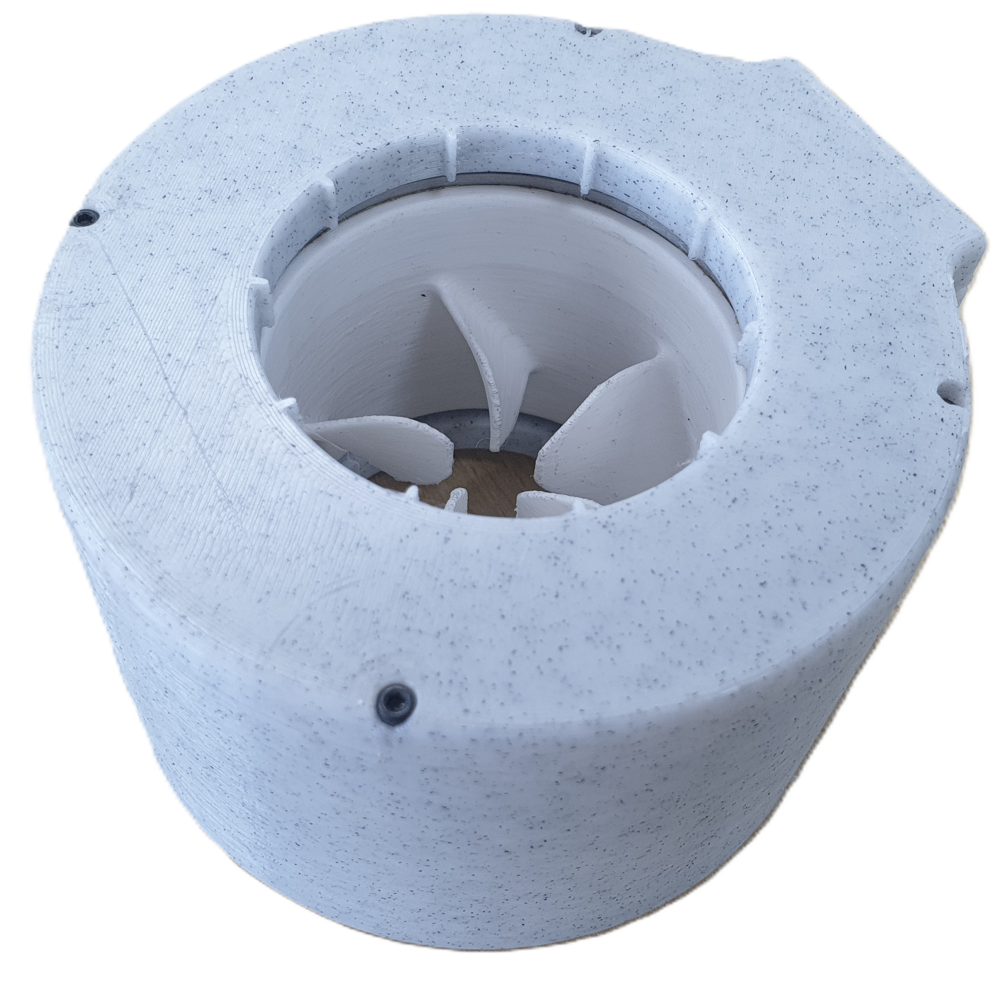

Developed in the "Nile University Innovation Hub", in this project I aimed to build a compact and integrated high-efficiency brushless Thruster from scratch for Autonomous Underwater Vehicles (AUVs).

**Design Features:**
* **Innovative Architecture**: Designed a hub-less, rim-driven configuration to maximize efficiency and minimize size.
* **Harsh Environment Engineering**: Specifically built to withstand corrosive underwater conditions while maintaining symmetrical thrust performance.
* **Custom Manufacturing**: Built a mini custom brushless motor winding machines to accelerate the rapid prototyping phase of the stator.

## Video Demonstration


## System Architecture & Components
Below is the exploded design view of the custom brushless motor assembly, detailing the hubless mechanical structure.
The motor consists of the external body and lid, housing two custome stainless steel roller bearings, and the custome wound stator. Inside the stator, the rotor which integrates the propellers is centered between both bearings.

## Final Prototype
Here is the final, fully assembled Rim-Driven Hubless BLDC Thruster prototype.

