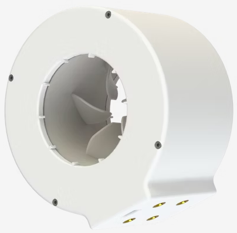

Developed at the Nile University Innovation Hub, this project aimed to create a compact, high-efficiency propulsion system for Autonomous Underwater Vehicles (AUVs).

**Design Features:**
* **Innovative Architecture**: Designed a hub-less, rim-driven configuration to maximize efficiency and minimize size.
* **Harsh Environment Engineering**: Specifically built to withstand corrosive underwater conditions while maintaining symmetrical thrust performance.
* **Custom Manufacturing**: Built custom brushless motor winding machines to accelerate the rapid prototyping phase of these electromagnetic actuators.

## Video Demonstration


## System Architecture & Components
Below is the exploded design view of the custom brushless motor assembly, detailing the internal electromagnetic arrangement and the hubless mechanical integration.

## Final Prototype
Here is the fully assembled, physical Rim-Driven Hubless BLDC Thruster prototype ready for aquatic deployment and testing.

